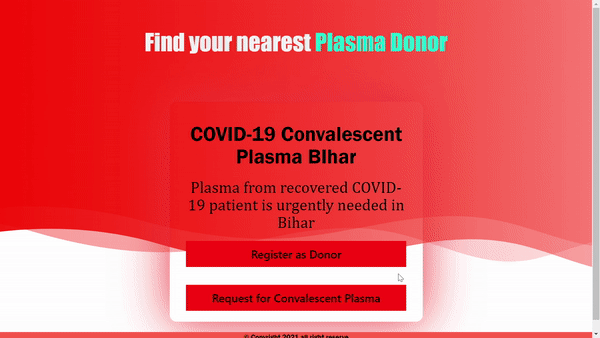
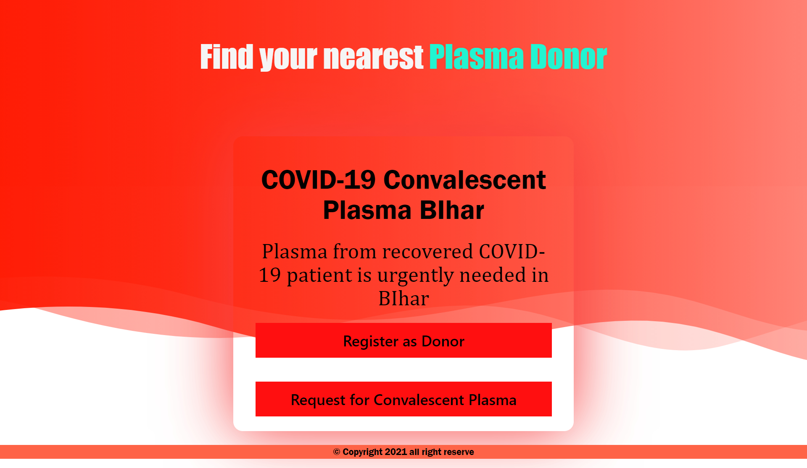

# Find Your Nearest Plasma Donor

```diff 
+ Under  Construction 
``` 

<!-------->
<h1>Hey..! 🧑‍⚕️ </h1>
<p>Welcome to Plasma Donor project. As we all know, we are facing a global pandemic named as COVID-19. Scientists are trying to discover vaccines to cure people affected with corona virus. In this critical situation different types of treatments are given by different doctors. Some doctors recommended plasma therapy for the patient who is in the critical situation. In this situation it is difficult for a patient to find a donor as everybody can’t donate plasma.</p>


<h2>WHAT IS PLASMA THERAPY ?</h2>
		<p>The therapy aims at using antibodies from the bl ood of a recovered COVID-19 patient to treat those critically infected by the virus. Plasma is a blood component that contains virus-fighting antibodies. It is like blood donation, however, in the same plasma gets separated from the blood and the remaining blood will be transferred back to your body resulting in zero blood loss. The procedure is completely harmless and the donor does not experience any pain, sickness or dizziness..</p>
		<p>Convalescent plasma is the liquid part of blood that is collected from patients who have recovered from the novel coronavirus disease, COVID19, caused by the virus SARS-CoV-2. COVID-19 patients develop antibodies in the blood against the virus. Antibodies are proteins that might help fight the infection..</p>


<h1>Project Goal</h1>

<p>The main goal of our project is to make it easier for the COVID-19 patients of BIHAR to get a plasma donor easily and as soon as possible as it is too much difficult to find a plasma donor. In most of the case, it has seen that COVID-19 patients look for plasma in facebook group or just by posting randomly which in some case is not helpful. Here our project will help the patient to find a donor fast when they need.</p>

<h1>Work Flow</h1>

<p>The person who wants to donate his/her plasma need to register and create his/her profile first in our application providing required information which are name, blood group, phone number and address.<br>
Patients who need plasma also need to create account, register his/her required information.</p>

<h1>Languages</h1>


<h1>Contributers :two_men_holding_hands:</h1> 

<table>
  <tr>
   <td align="center"><a href="https://shivam648.github.io/Shivam_Portfolio/"><br/><sub><b>Shivam Jaiswal</b></sub></a><br/><sub><b>Frontend</b></sub></td>
    <td align="center"><a href="https://github.com/sonu957668"><br/><sub><b>Sonu Kumar</b></sub></a><br/><sub><b>Backend</b></sub></td>
  </tr>
  </table>
  
  If you want to share any kind of suggestions to improve our work please let us know by creating an issue [here](https://github.com/Shivam648/Plasma_Donor/issues)

